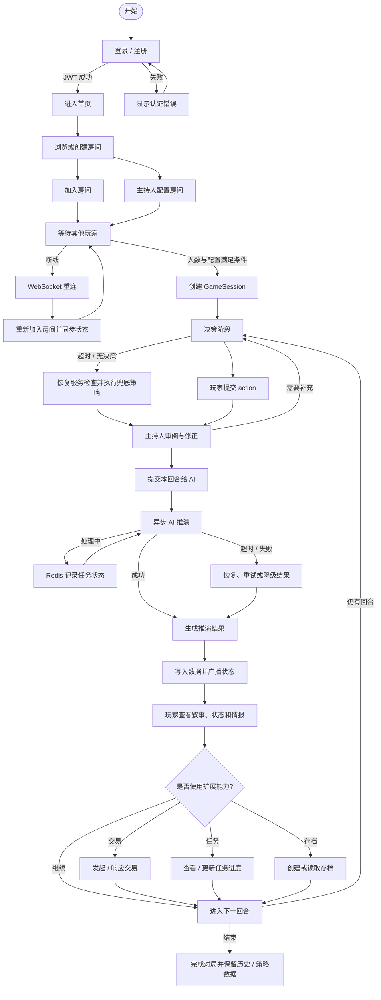
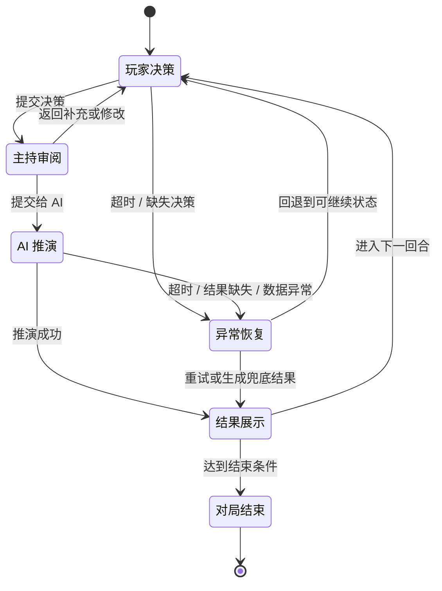
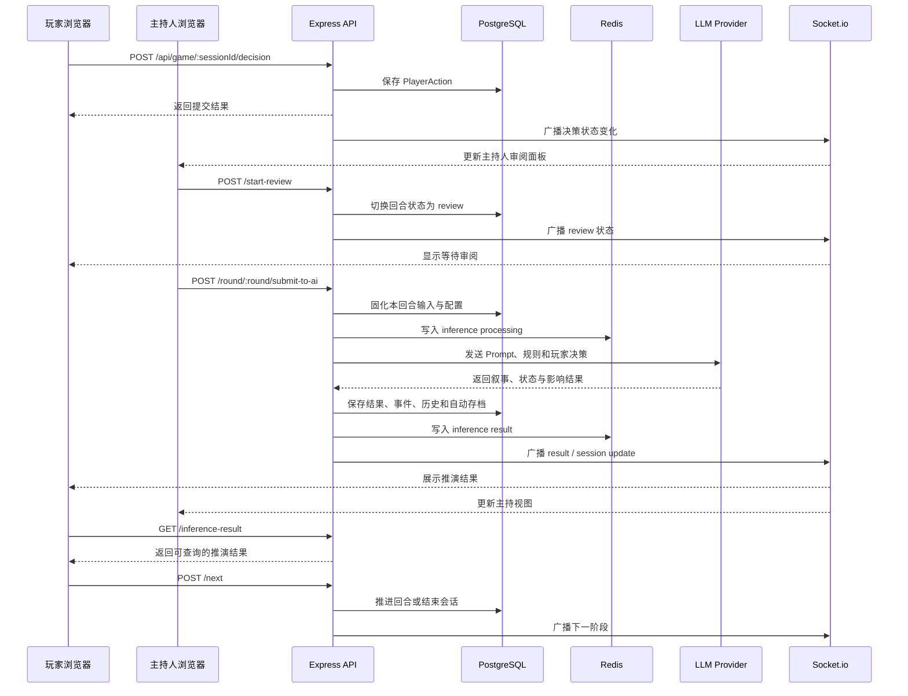
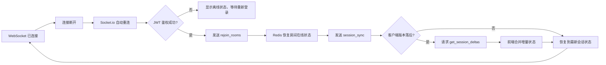

# AI-Group1 产品工作流示意图

> 本文档描述当前产品的主要使用闭环：用户登录后进入房间，由主持人完成配置，玩家提交回合决策，后端调用 AI 推演并通过 REST/WebSocket 返回结果，最后进入下一回合或保存结束。

## 一、核心产品闭环

## 二、回合状态机

## 三、决策到推演的跨层时序

## 四、断线重连与状态恢复

## 五、关键节点与代码入口

| 工作流节点 | 代码入口 | 作用 |
| --- | --- | --- |
| 登录 / 注册 | `rebuild/production/frontend/src/pages/Login.tsx`、`rebuild/production/frontend/src/pages/Register.tsx`、`rebuild/production/backend/src/routes/auth.ts` | 建立用户身份并取得 JWT。 |
| 房间与主持配置 | `rebuild/production/frontend/src/pages/Rooms.tsx`、`rebuild/production/frontend/src/pages/WaitingRoom.tsx`、`rebuild/production/frontend/src/pages/HostSetup.tsx`、`rebuild/production/backend/src/routes/rooms.ts` | 创建房间、加入房间和生成主持配置。 |
| 玩家决策 | `rebuild/production/frontend/src/pages/GameSession.tsx`、`rebuild/production/backend/src/routes/game.ts` | 提交本回合决策并保存 `PlayerAction`。 |
| 主持审阅 | `rebuild/production/frontend/src/pages/HostReview.tsx`、`rebuild/production/backend/src/routes/game.ts` | 审阅、修正并提交回合。 |
| AI 推演 | `rebuild/production/backend/src/services/aiService.ts`、`rebuild/production/backend/src/services/PromptBuilder.ts` | 组合规则和上下文，调用模型 Provider 并解析结果。 |
| 状态广播 | `rebuild/production/backend/src/socket/`、`rebuild/production/frontend/src/services/websocket.ts` | 推送房间、会话、结果和连接状态。 |
| 异常恢复 | `rebuild/production/backend/src/services/GameRecoveryService.ts`、`rebuild/production/frontend/src/services/gameRecovery.ts` | 处理超时、结果缺失和会话状态异常。 |
| 扩展能力 | `rebuild/production/backend/src/routes/trade.ts`、`rebuild/production/backend/src/routes/tasks.ts`、`rebuild/production/backend/src/routes/strategies.ts`、`rebuild/production/frontend/src/pages/GameSave.tsx` | 交易、任务、策略分析和存档。 |

## 六、状态与数据落点

| 数据 | 主要落点 | 生命周期 |
| --- | --- | --- |
| 用户、房间、会话、决策、事件 | PostgreSQL / Prisma | 长期保存。 |
| 房间在线成员与实时状态 | Redis + Socket.io 房间 | 对局期间实时维护，断线时恢复。 |
| AI 推演任务与结果 | Redis + PostgreSQL | Redis 负责处理中状态和短期结果，PostgreSQL 保存最终业务结果。 |
| 自动存档与历史 | PostgreSQL | 推演完成后保存，支持后续查看和恢复。 |
| 登录态 | 浏览器 Zustand persist | 客户端持久化，过期后回到登录页。 |

## 七、当前运行前提

完整工作流至少需要：

1. Node.js `>= 18`。
2. PostgreSQL 运行在 `localhost:5432`，并完成 Prisma 迁移。
3. Redis 运行在 `localhost:6379`。
4. 前端开发服务运行在 `localhost:5173`，后端运行在 `localhost:3000`。
5. 若进行真实 AI 推演，还需要在主持配置中提供可用的 LLM Provider 地址和凭据。

Docker 只是项目当前推荐的 PostgreSQL/Redis 运行方式；它不是产品业务流程本身，但缺少数据库和 Redis 时，登录、房间、推演和恢复闭环不能完整运行。
