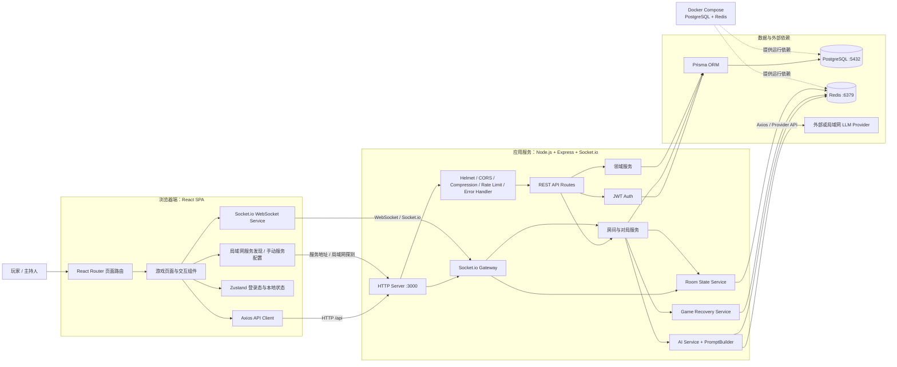
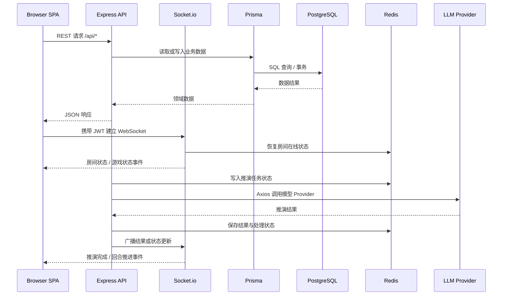

# AI-Group1 产品架构图

> 本文档依据当前仓库 `rebuild/production` 目录、`docs/项目说明书.md` 以及前后端入口代码整理。图中只描述当前代码中已经出现的主要模块和依赖。

## 一、运行时总览

## 二、代码分层与职责

| 层级 | 主要位置 | 职责 |
| --- | --- | --- |
| 页面与路由 | `rebuild/production/frontend/src/App.tsx`、`pages/`、`components/` | 登录、组局、主持配置、游戏回合、结果、交易、任务、策略和存档页面。 |
| 前端服务 | `rebuild/production/frontend/src/services/` | 封装 HTTP、WebSocket、游戏、房间、服务发现和恢复请求。 |
| 前端状态 | `rebuild/production/frontend/src/stores/`、`hooks/` | 持久化登录态、连接状态、会话计时和交互状态。 |
| HTTP 入口 | `rebuild/production/backend/src/server.ts` | 创建 Express/HTTP 服务，挂载中间件、健康检查和 REST 路由。 |
| REST 路由 | `rebuild/production/backend/src/routes/` | 认证、用户、房间、游戏、交易、任务、策略和管理员接口。 |
| 实时通信 | `rebuild/production/backend/src/socket/` | Socket 鉴权、房间加入/离开、会话同步、心跳和增量状态广播。 |
| 领域服务 | `rebuild/production/backend/src/services/` | AI 推演、Prompt 构建、房间状态、异常恢复和业务编排。 |
| 持久化 | `rebuild/production/backend/src/utils/db.ts`、`prisma/` | 通过 Prisma 访问 PostgreSQL 中的用户、房间、会话、决策、任务、交易和存档。 |
| 缓存与实时状态 | `rebuild/production/backend/src/utils/redis.ts` | 保存房间在线状态、推演任务状态、推演结果和短期缓存。 |
| 运维启动 | `run-local.bat`、`run-dev.bat`、`tools/` | 检查环境、准备依赖和环境变量，并启动前后端开发服务。 |

## 三、主要通信边界

## 四、部署与端口

| 组件 | 默认地址或端口 | 说明 |
| --- | --- | --- |
| React/Vite 前端 | `http://localhost:5173` | 开发模式前端入口。 |
| Node.js 后端 | `http://localhost:3000` | REST API、健康检查和 Socket.io 共用后端端口。 |
| PostgreSQL | `localhost:5432` | Prisma 主数据存储。 |
| Redis | `localhost:6379` | 房间状态、推演状态和短期缓存。 |
| 健康检查 | `http://localhost:3000/health` | 后端进程健康检查，不等同于数据库完全可用。 |

基础设施定义位于 `rebuild/production/backend/docker-compose.yml`。项目当前默认启动链路需要 PostgreSQL 和 Redis；没有这两个服务时，前后端依赖安装可以完成，但数据库迁移、种子数据和后端完整启动流程无法验收。

## 五、架构边界

- 浏览器通过 Axios 调用 REST API，通过 Socket.io 接收房间和会话实时状态。
- PostgreSQL 保存长期业务数据，Redis 保存在线状态、推演任务和短期结果，两者职责不同。
- AI Provider 是外部依赖，模型请求由后端 `aiService.ts` 统一组织，前端不直接调用模型服务。
