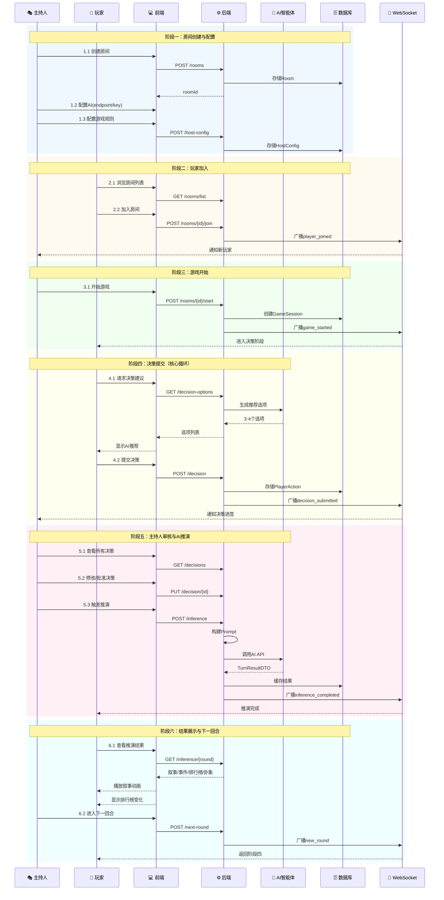

# AI文字交互式游戏 - 全景泳道图

## 完整游戏流程（六阶段）




---

## 角色职责说明

| 角色 | 职责 | 关键操作 |
|------|------|----------|
| 🎭 主持人 | 游戏组织者 | 创建房间、配置AI、审核决策、触发推演 |
| 👤 玩家 | 游戏参与者 | 加入房间、提交决策、查看结果 |
| 🤖 AI智能体 | 推演引擎 | 生成决策建议、执行推演、输出叙事 |
| ⚙️ 后端 | 业务协调 | 状态管理、Prompt构建、结果解析 |
| 🗄️ 数据库 | 持久存储 | PostgreSQL(业务数据) + Redis(缓存) |
| 📡 WebSocket | 实时通信 | 状态同步、事件广播 |

---

## 数据流向总结

```
主持人配置 ──→ 后端存储 ──→ 游戏开始
                              ↓
玩家决策 ──→ 后端收集 ──→ 主持人审核
                              ↓
              Prompt构建 ──→ AI推演
                              ↓
              结果解析 ←── AI输出(JSON)
                              ↓
              WebSocket广播 ──→ 前端展示
                              ↓
              下一回合 ←── 循环继续
```

---

*生成时间: 2025-12-25*
