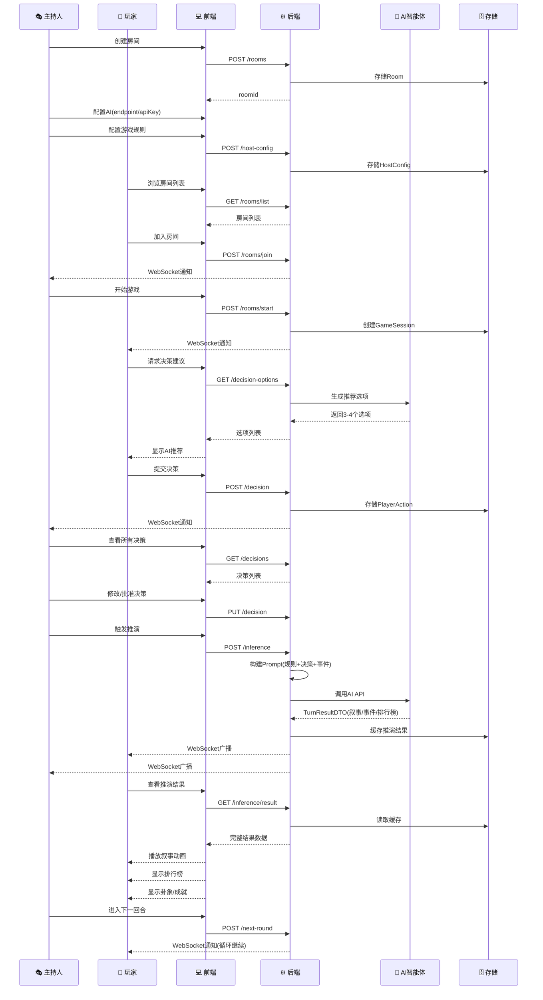

# AI文字交互式游戏 - 完整泳道图

```mermaid
sequenceDiagram
    participant H as 🎭 主持人
    participant P as 👤 玩家
    participant FE as 💻 前端
    participant BE as ⚙️ 后端
    participant AI as 🤖 AI智能体
    participant DB as 🗄️ 存储

    H->>FE: 创建房间
    FE->>BE: POST /rooms
    BE->>DB: 存储Room
    BE-->>FE: roomId
    H->>FE: 配置AI(endpoint/apiKey)
    H->>FE: 配置游戏规则
    FE->>BE: POST /host-config
    BE->>DB: 存储HostConfig
    P->>FE: 浏览房间列表
    FE->>BE: GET /rooms/list
    BE-->>FE: 房间列表
    P->>FE: 加入房间
    FE->>BE: POST /rooms/join
    BE-->>H: WebSocket通知
    H->>FE: 开始游戏
    FE->>BE: POST /rooms/start
    BE->>DB: 创建GameSession
    BE-->>P: WebSocket通知
    P->>FE: 请求决策建议
    FE->>BE: GET /decision-options
    BE->>AI: 生成推荐选项
    AI-->>BE: 返回3-4个选项
    BE-->>FE: 选项列表
    FE-->>P: 显示AI推荐
    P->>FE: 提交决策
    FE->>BE: POST /decision
    BE->>DB: 存储PlayerAction
    BE-->>H: WebSocket通知
    H->>FE: 查看所有决策
    FE->>BE: GET /decisions
    BE-->>FE: 决策列表
    H->>FE: 修改/批准决策
    FE->>BE: PUT /decision
    H->>FE: 触发推演
    FE->>BE: POST /inference
    BE->>BE: 构建Prompt(规则+决策+事件)
    BE->>AI: 调用AI API
    AI-->>BE: TurnResultDTO(叙事/事件/排行榜)
    BE->>DB: 缓存推演结果
    BE-->>P: WebSocket广播
    BE-->>H: WebSocket广播
    P->>FE: 查看推演结果
    FE->>BE: GET /inference/result
    BE->>DB: 读取缓存
    BE-->>FE: 完整结果数据
    FE-->>P: 播放叙事动画
    FE-->>P: 显示排行榜
    FE-->>P: 显示卦象/成就
    H->>FE: 进入下一回合
    FE->>BE: POST /next-round
    BE-->>P: WebSocket通知(循环继续)
```
