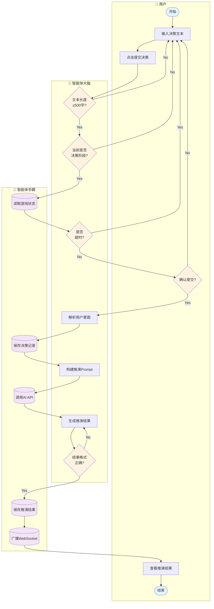

# 主线任务指引（输入解析）泳道图

## 负责人：陈卓

---

## 泳道图（Mermaid Flowchart 格式）

---

## 流程说明

| 步骤 | 泳道 | 节点 | 说明 |
|------|------|------|------|
| 1 | 用户 | 开始 | 玩家进入游戏决策页面 |
| 2 | 用户 | 输入决策文本 | 在文本框中描述行动意图 |
| 3 | 用户 | 点击提交决策 | 触发提交流程 |
| 4 | 智能体大脑 | 文本长度≤500字? | 前端校验字符数限制 |
| 5 | 智能体大脑 | 当前是否决策阶段? | 检查游戏回合状态 |
| 6 | 智能体手脚 | 读取游戏状态 | 从数据库获取会话信息 |
| 7 | 智能体大脑 | 是否超时? | 比对当前时间与截止时间 |
| 8 | 用户 | 确认提交? | 用户最终确认 |
| 9 | 智能体大脑 | 解析用户意图 | NLP解析决策文本含义 |
| 10 | 智能体手脚 | 保存决策记录 | 写入PlayerDecision表 |
| 11 | 智能体大脑 | 构建推演Prompt | 组装游戏规则+决策+状态 |
| 12 | 智能体手脚 | 调用AI API | 发送请求到LLM服务 |
| 13 | 智能体大脑 | 生成推演结果 | AI返回叙事和结果 |
| 14 | 智能体大脑 | 结果格式正确? | 校验JSON结构完整性 |
| 15 | 智能体手脚 | 保存推演结果 | 写入RoundResult表 |
| 16 | 智能体手脚 | 广播WebSocket | 通知所有玩家结果就绪 |
| 17 | 用户 | 查看推演结果 | 展示剧情和资源变化 |
| 18 | 用户 | 结束 | 本回合决策流程完成 |

---

## 数据对象

| 图标 | 数据对象 | 存储位置 |
|------|----------|----------|
| 📄 | 决策文本 | PlayerDecision.actionText |
| 🗄️ | 游戏状态 | GameSession |
| 📊 | 推演结果 | RoundResult |
| 📡 | WebSocket消息 | 实时广播 |
