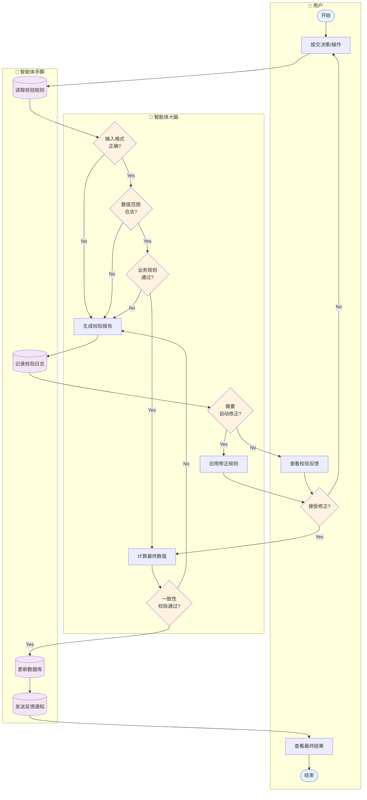

# 反馈系统（数值校验）泳道图

## 负责人：伍慧欣

---

## 泳道图（Mermaid Flowchart 格式）

---

## 流程说明

| 步骤 | 泳道 | 节点 | 说明 |
|------|------|------|------|
| 1 | 用户 | 开始 | 用户发起操作请求 |
| 2 | 用户 | 提交决策/操作 | 提交需要校验的数据 |
| 3 | 智能体手脚 | 读取校验规则 | 从配置加载校验Schema |
| 4 | 智能体大脑 | 输入格式正确? | Zod Schema格式校验 |
| 5 | 智能体大脑 | 数值范围合法? | 检查min/max边界 |
| 6 | 智能体大脑 | 业务规则通过? | 状态、权限、时间校验 |
| 7 | 智能体大脑 | 生成校验报告 | 汇总所有校验错误 |
| 8 | 智能体手脚 | 记录校验日志 | 写入审计日志 |
| 9 | 智能体大脑 | 需要自动修正? | 判断是否可自动修复 |
| 10 | 智能体大脑 | 应用修正规则 | 执行数值修正逻辑 |
| 11 | 用户 | 查看校验反馈 | 显示错误提示信息 |
| 12 | 用户 | 接受修正? | 用户确认修正方案 |
| 13 | 智能体大脑 | 计算最终数值 | 执行业务计算 |
| 14 | 智能体大脑 | 一致性校验通过? | 最终数据一致性检查 |
| 15 | 智能体手脚 | 更新数据库 | 持久化校验后数据 |
| 16 | 智能体手脚 | 发送反馈通知 | WebSocket推送结果 |
| 17 | 用户 | 查看最终结果 | 展示处理结果 |
| 18 | 用户 | 结束 | 校验流程完成 |

---

## 校验规则清单

| 校验类型 | 校验项 | 规则 | 错误码 |
|----------|--------|------|--------|
| 格式校验 | 字符串长度 | 1-500字符 | 400 |
| 格式校验 | 数值类型 | 必须为number | 400 |
| 范围校验 | 金币变化 | -1000 ~ +1000 | 422 |
| 范围校验 | 能量变化 | -100 ~ +100 | 422 |
| 范围校验 | 百分比 | 0% ~ 100% | 422 |
| 业务校验 | 会话状态 | status=playing | 409 |
| 业务校验 | 回合阶段 | roundStatus=decision | 403 |
| 业务校验 | 截止时间 | now ≤ deadline | 408 |
| 一致性校验 | 资源非负 | value ≥ 0 | 422 |
| 一致性校验 | 总数一致 | total = sum(parts) | 500 |

---

## 数据对象

| 图标 | 数据对象 | 说明 |
|------|----------|------|
| 📋 | 校验规则 | Zod Schema定义 |
| 📝 | 校验日志 | 审计记录 |
| 🗄️ | 业务数据 | 校验后的数据 |
| 📡 | 反馈通知 | 错误/成功消息 |
