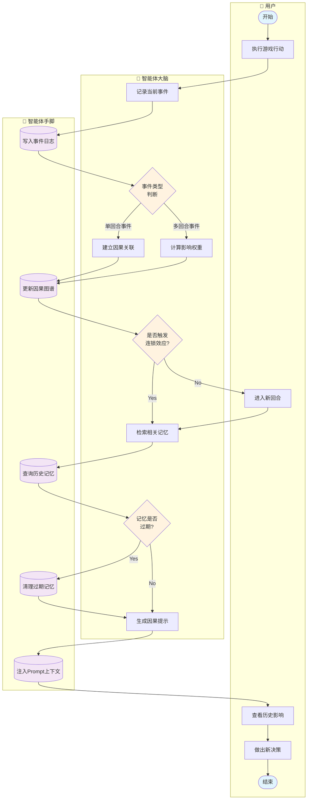

# 跨周期记忆（因果引擎）泳道图

## 负责人：焦雪晴

---

## 泳道图（Mermaid Flowchart 格式）



---

## 流程说明

| 步骤 | 泳道 | 节点 | 说明 |
|------|------|------|------|
| 1 | 用户 | 开始 | 玩家开始游戏回合 |
| 2 | 用户 | 执行游戏行动 | 提交决策或触发事件 |
| 3 | 智能体大脑 | 记录当前事件 | 捕获行动和结果 |
| 4 | 智能体手脚 | 写入事件日志 | 持久化到GameEvent表 |
| 5 | 智能体大脑 | 事件类型判断 | 区分单回合/多回合事件 |
| 6 | 智能体大脑 | 建立因果关联 | 关联事件与后续影响 |
| 7 | 智能体大脑 | 计算影响权重 | 评估事件影响程度 |
| 8 | 智能体手脚 | 更新因果图谱 | 维护事件关系网络 |
| 9 | 智能体大脑 | 是否触发连锁效应? | 检查是否激活其他事件 |
| 10 | 智能体大脑 | 检索相关记忆 | 查找历史关联事件 |
| 11 | 智能体手脚 | 查询历史记忆 | 从数据库检索 |
| 12 | 智能体大脑 | 记忆是否过期? | 检查有效回合数 |
| 13 | 智能体手脚 | 清理过期记忆 | 标记失效事件 |
| 14 | 智能体大脑 | 生成因果提示 | 构建历史影响描述 |
| 15 | 智能体手脚 | 注入Prompt上下文 | 添加到AI推演输入 |
| 16 | 用户 | 查看历史影响 | 展示因果关系提示 |
| 17 | 用户 | 进入新回合 | 开始下一决策周期 |
| 18 | 用户 | 做出新决策 | 基于历史做决策 |
| 19 | 用户 | 结束 | 因果链处理完成 |

---

## 因果引擎核心逻辑

### 事件类型

| 类型 | 代码 | 有效期 | 说明 |
|------|------|--------|------|
| 单回合事件 | single_round | 1回合 | 仅影响当前回合 |
| 多回合事件 | multi_round | N回合 | 持续影响多个回合 |
| 永久规则 | rule | 永久 | 直到游戏结束 |

### 因果权重计算

```
影响权重 = 基础权重 × 衰减系数 × 关联度
衰减系数 = 1 / (1 + 经过回合数 × 0.2)
关联度 = 事件相关性评分 (0-1)
```

### 记忆检索策略

| 策略 | 条件 | 优先级 |
|------|------|--------|
| 直接因果 | 事件直接导致 | 最高 |
| 间接关联 | 同类型事件 | 中等 |
| 时间邻近 | 相邻回合 | 较低 |
| 玩家相关 | 同一玩家 | 较低 |

---

## 数据对象

| 图标 | 数据对象 | 存储位置 |
|------|----------|----------|
| 📅 | 事件日志 | GameEvent表 |
| 🕸️ | 因果图谱 | EventRelation表 |
| 🧠 | 历史记忆 | MemoryContext |
| 📝 | 因果提示 | Prompt上下文 |
