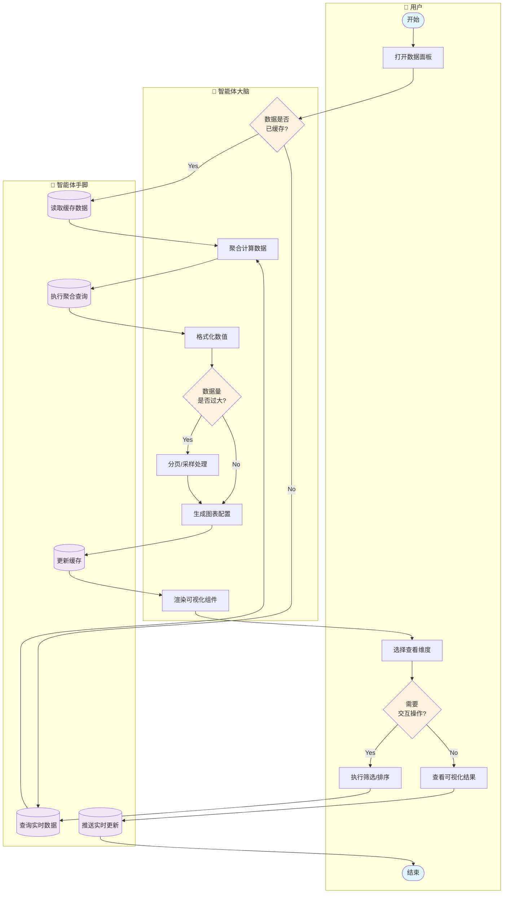

# 可视化数据面板泳道图

## 负责人：郄昊曈

---

## 泳道图（Mermaid Flowchart 格式）

---

## 流程说明

| 步骤 | 泳道 | 节点 | 说明 |
|------|------|------|------|
| 1 | 用户 | 开始 | 用户进入数据面板 |
| 2 | 用户 | 打开数据面板 | 访问统计/排行页面 |
| 3 | 智能体大脑 | 数据是否已缓存? | 检查Redis缓存 |
| 4 | 智能体手脚 | 查询实时数据 | 从数据库获取最新数据 |
| 5 | 智能体手脚 | 读取缓存数据 | 从Redis读取 |
| 6 | 智能体大脑 | 聚合计算数据 | 执行统计计算 |
| 7 | 智能体手脚 | 执行聚合查询 | SQL聚合函数 |
| 8 | 智能体大脑 | 格式化数值 | 千分位、百分比等 |
| 9 | 智能体大脑 | 数据量是否过大? | 检查记录数量 |
| 10 | 智能体大脑 | 分页/采样处理 | 限制展示数据量 |
| 11 | 智能体大脑 | 生成图表配置 | 构建ECharts配置 |
| 12 | 智能体手脚 | 更新缓存 | 写入Redis |
| 13 | 智能体大脑 | 渲染可视化组件 | 前端图表渲染 |
| 14 | 用户 | 选择查看维度 | 切换统计维度 |
| 15 | 用户 | 需要交互操作? | 判断是否筛选 |
| 16 | 用户 | 执行筛选/排序 | 应用过滤条件 |
| 17 | 用户 | 查看可视化结果 | 展示图表和数据 |
| 18 | 智能体手脚 | 推送实时更新 | WebSocket推送 |
| 19 | 用户 | 结束 | 完成数据查看 |

---

## 可视化组件清单

| 组件 | 数据类型 | 展示内容 |
|------|----------|----------|
| 统计卡片 | Statistic | 总游戏数、胜率、平均回合 |
| 进度条 | Progress | 任务进度、胜率进度 |
| 排行榜 | Table | 玩家排名、得分排名 |
| 时间线 | Timeline | 回合历史、事件记录 |
| 折线图 | Line Chart | 资源变化趋势 |
| 饼图 | Pie Chart | 状态分布、类型占比 |

---

## 数据格式化规则

| 数据类型 | 格式化规则 | 示例 |
|----------|------------|------|
| 金币 | 千分位 | 12,345 |
| 百分比 | 2位小数 | 67.89% |
| 时间 | 本地化 | 2024-12-25 14:30 |
| 变化值 | 带符号+颜色 | +100(绿) / -50(红) |

---

## 数据对象

| 图标 | 数据对象 | 说明 |
|------|----------|------|
| 📊 | 统计数据 | 聚合计算结果 |
| 💾 | 缓存数据 | Redis缓存 |
| 📈 | 图表配置 | ECharts配置对象 |
| 📡 | 实时更新 | WebSocket推送 |
