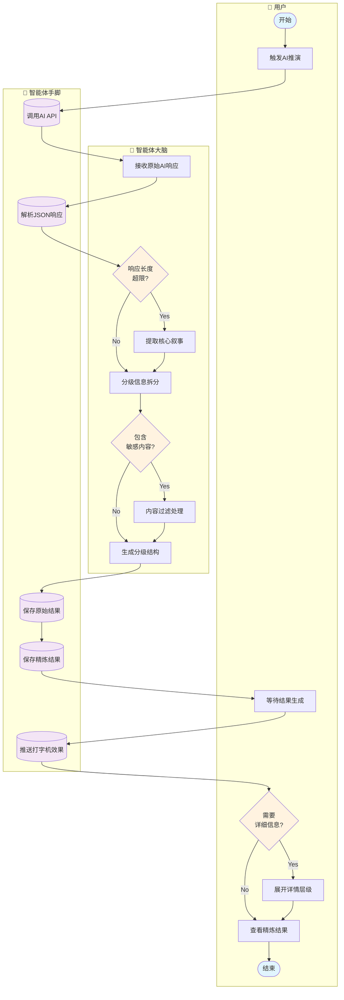

# 回复信息精炼（分级反馈）泳道图

## 负责人：周晓希

---

## 泳道图（Mermaid Flowchart 格式）



---

## 流程说明

| 步骤 | 泳道 | 节点 | 说明 |
|------|------|------|------|
| 1 | 用户 | 开始 | 主持人提交AI推演 |
| 2 | 用户 | 触发AI推演 | 点击提交推演按钮 |
| 3 | 智能体手脚 | 调用AI API | 发送请求到LLM |
| 4 | 智能体大脑 | 接收原始AI响应 | 获取完整响应文本 |
| 5 | 智能体手脚 | 解析JSON响应 | 提取结构化数据 |
| 6 | 智能体大脑 | 响应长度超限? | 检查字符数>5000 |
| 7 | 智能体大脑 | 提取核心叙事 | 截取关键段落 |
| 8 | 智能体大脑 | 分级信息拆分 | 按重要性分层 |
| 9 | 智能体大脑 | 包含敏感内容? | 内容安全检查 |
| 10 | 智能体大脑 | 内容过滤处理 | 移除/替换敏感词 |
| 11 | 智能体大脑 | 生成分级结构 | 构建层级数据 |
| 12 | 智能体手脚 | 保存原始结果 | 存档完整响应 |
| 13 | 智能体手脚 | 保存精炼结果 | 存储分级数据 |
| 14 | 用户 | 等待结果生成 | 显示加载状态 |
| 15 | 智能体手脚 | 推送打字机效果 | 逐字显示叙事 |
| 16 | 用户 | 需要详细信息? | 判断是否展开 |
| 17 | 用户 | 展开详情层级 | 查看更多细节 |
| 18 | 用户 | 查看精炼结果 | 展示最终内容 |
| 19 | 用户 | 结束 | 信息展示完成 |

---

## 分级反馈结构

### 信息层级定义

| 层级 | 名称 | 内容 | 展示方式 |
|------|------|------|----------|
| L1 | 核心摘要 | 一句话结果 | 始终显示 |
| L2 | 主要叙事 | 剧情描述 | 打字机效果 |
| L3 | 详细结果 | 资源变化 | 卡片列表 |
| L4 | 扩展信息 | 事件/提示 | 可折叠面板 |

### 精炼规则

| 规则 | 条件 | 处理方式 |
|------|------|----------|
| 长度截断 | >5000字符 | 保留前3000字+省略提示 |
| 段落提取 | 多段落 | 提取首段作为摘要 |
| 关键词高亮 | 资源变化 | 添加颜色标记 |
| 敏感过滤 | 违规内容 | 替换为[已过滤] |

### 打字机效果配置

```
速度: 20ms/字符
暂停: 标点符号后100ms
跳过: 用户点击可跳过
```

---

## 数据对象

| 图标 | 数据对象 | 说明 |
|------|----------|------|
| 📄 | 原始响应 | AI完整输出 |
| 📝 | 精炼结果 | 分级处理后数据 |
| 🎬 | 打字机状态 | 显示进度控制 |
| 📊 | 分级结构 | 层级化数据对象 |
