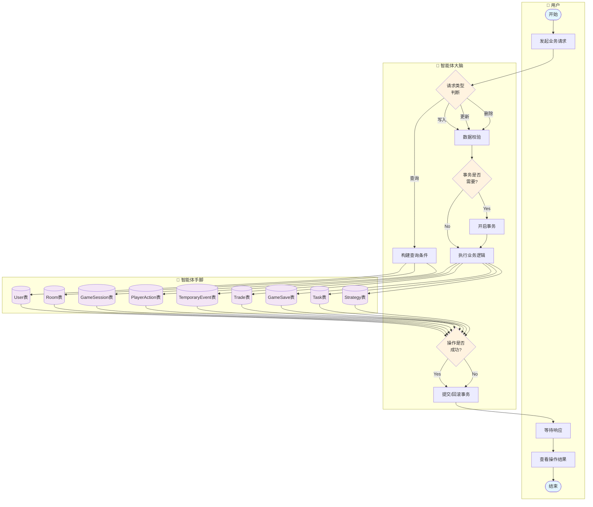
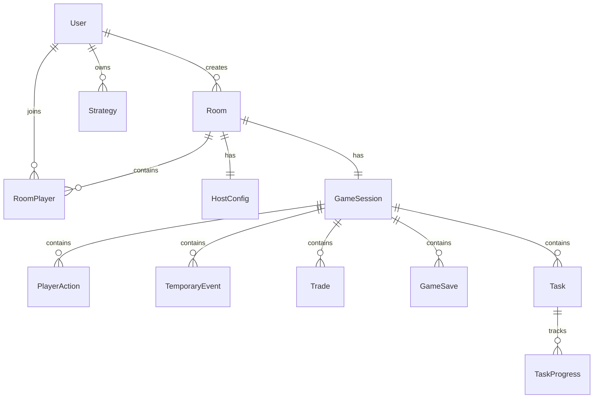

# 数据库操作流程泳道图

## 数据库：PostgreSQL + Prisma ORM

---

## 泳道图（Mermaid Flowchart 格式）

---

## 数据库表结构

### 核心表关系

### 表清单

| 表名 | 中文名 | 主要字段 | 说明 |
|------|--------|----------|------|
| users | 用户表 | id, username, password, nickname, level | 用户账户信息 |
| game_rooms | 房间表 | id, name, hostId, status, maxPlayers | 游戏房间 |
| room_players | 房间玩家表 | roomId, userId, role, playerIndex | 房间成员关系 |
| host_configurations | 主持人配置表 | roomId, apiConfig, gameRules | AI和规则配置 |
| game_sessions | 游戏会话表 | roomId, currentRound, roundStatus | 游戏进行状态 |
| player_actions | 玩家行动表 | sessionId, userId, round, actionText | 决策记录 |
| temporary_events | 临时事件表 | sessionId, eventType, effectiveRounds | 多回合事件 |
| trades | 交易表 | sessionId, initiatorId, targetId, resources | 玩家交易 |
| game_saves | 游戏存档表 | sessionId, saveData, isAutoSave | 存档快照 |
| game_tasks | 任务表 | sessionId, title, requirements, rewards | 游戏任务 |
| task_progress | 任务进度表 | taskId, userId, progress, status | 玩家任务进度 |
| user_strategies | 策略表 | userId, strategyData, winRate | 用户策略分析 |

---

## 流程说明

| 步骤 | 泳道 | 节点 | 说明 |
|------|------|------|------|
| 1 | 用户 | 开始 | 用户发起操作 |
| 2 | 用户 | 发起业务请求 | HTTP/WebSocket请求 |
| 3 | 智能体大脑 | 请求类型判断 | 区分CRUD操作 |
| 4 | 智能体大脑 | 构建查询条件 | Prisma查询构建 |
| 5 | 智能体大脑 | 数据校验 | Zod Schema验证 |
| 6 | 智能体大脑 | 事务是否需要? | 判断是否多表操作 |
| 7 | 智能体大脑 | 开启事务 | prisma.$transaction |
| 8 | 智能体大脑 | 执行业务逻辑 | 调用Prisma方法 |
| 9 | 智能体手脚 | 操作数据表 | 执行SQL语句 |
| 10 | 智能体大脑 | 操作是否成功? | 检查执行结果 |
| 11 | 智能体大脑 | 提交/回滚事务 | 事务处理 |
| 12 | 用户 | 等待响应 | 等待API返回 |
| 13 | 用户 | 查看操作结果 | 展示成功/失败 |
| 14 | 用户 | 结束 | 操作完成 |

---

## 核心CRUD操作

### 用户模块

| 操作 | API | 数据表 | Prisma方法 |
|------|-----|--------|------------|
| 注册 | POST /auth/register | users | create |
| 登录 | POST /auth/login | users | findUnique + update |
| 获取信息 | GET /user/info | users | findUnique |
| 更新信息 | PUT /user/info | users | update |

### 房间模块

| 操作 | API | 数据表 | Prisma方法 |
|------|-----|--------|------------|
| 创建房间 | POST /rooms | game_rooms | create |
| 加入房间 | POST /rooms/:id/join | room_players | create |
| 离开房间 | POST /rooms/:id/leave | room_players | update |
| 关闭房间 | POST /rooms/:id/close | game_rooms | update |

### 游戏模块

| 操作 | API | 数据表 | Prisma方法 |
|------|-----|--------|------------|
| 开始游戏 | POST /game/:roomId/start | game_sessions | create/update |
| 提交决策 | POST /game/:id/decision | player_actions | create/update |
| 添加事件 | POST /game/:id/temporary-event | temporary_events | create |
| 保存存档 | POST /game/:id/save | game_saves | create |
| 获取状态 | GET /game/:id/state | game_sessions | findUnique |

### 交易模块

| 操作 | API | 数据表 | Prisma方法 |
|------|-----|--------|------------|
| 发起交易 | POST /trade | trades | create |
| 响应交易 | POST /trade/:id/respond | trades | update |
| 取消交易 | POST /trade/:id/cancel | trades | update |

---

## 事务处理场景

| 场景 | 涉及表 | 事务操作 |
|------|--------|----------|
| 开始游戏 | game_sessions, room_players | 创建会话 + 更新玩家状态 |
| 接受交易 | trades, users(资源) | 更新交易状态 + 转移资源 |
| 完成任务 | task_progress, users | 更新进度 + 发放奖励 |
| 回合结算 | player_actions, game_sessions | 保存结果 + 更新回合 |

---

## 数据对象

| 图标 | 数据对象 | 说明 |
|------|----------|------|
| 👤 | User | 用户账户 |
| 🏠 | Room | 游戏房间 |
| 🎮 | GameSession | 游戏会话 |
| ✋ | PlayerAction | 玩家决策 |
| ⚡ | TemporaryEvent | 临时事件 |
| 💱 | Trade | 玩家交易 |
| 💾 | GameSave | 游戏存档 |
| 📋 | Task | 游戏任务 |
| 📊 | Strategy | 用户策略 |
